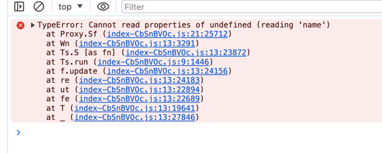

# alias-broken

this is a mini example to reproduce alias broken. See HEAD, in main.ts
```diff
diff --git a/portal/src/main.ts b/portal/src/main.ts
index 9f26743..83d366d 100644
--- a/portal/src/main.ts
+++ b/portal/src/main.ts
@@ -1,6 +1,6 @@
 import { createApp } from 'vue'
 import App from './App.vue'
-import { router } from './router'
+import { router } from '@/router'
 import './index.css'
```

when use `@` instead of '.' to access route.ts.

the build artifact will be broken. 

## How to reproduce
```shell
bazel build //portal:build
cd bazel-bin/portal/dist
python3 -m http.server
# open http://localhost:8000
```

## Interesting phenomenon

the artifact of `.`(normal) and `@`(broken) are different.

### normal
```text
✓ 36 modules transformed.
dist/index.html                    0.50 kB │ gzip:  0.33 kB
dist/assets/index-BGEcXHhi.css     6.41 kB │ gzip:  1.99 kB
dist/assets/TodoItem-3GEL1qYC.js   0.48 kB │ gzip:  0.35 kB
dist/assets/Done-CFFU6RjI.js       0.55 kB │ gzip:  0.38 kB
dist/assets/Todo-ZG60pojG.js       1.12 kB │ gzip:  0.67 kB
dist/assets/index-CTz7Zq0A.js     83.00 kB │ gzip: 33.11 kB
```

### broken
```text
✓ 58 modules transformed.
dist/index.html                      0.50 kB │ gzip:  0.32 kB
dist/assets/index-BGEcXHhi.css       6.41 kB │ gzip:  1.99 kB
dist/assets/TodoItem-Dgr8oiEt.js     0.48 kB │ gzip:  0.35 kB
dist/assets/Done-C2xh-6Lk.js         0.55 kB │ gzip:  0.37 kB
dist/assets/Done-XlAKimco.js         0.55 kB │ gzip:  0.37 kB
dist/assets/todoStore-Cc-xlvHv.js    0.85 kB │ gzip:  0.51 kB
dist/assets/Todo-BZQWSg1f.js         1.12 kB │ gzip:  0.66 kB
dist/assets/Todo-D8mEd7di.js         1.12 kB │ gzip:  0.66 kB
dist/assets/index-CbSnBVOc.js      106.38 kB │ gzip: 34.94 kB
```

### others
portal code is copied from https://github.com/beary/vite-example.git